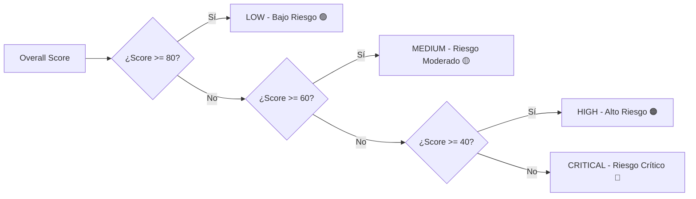

# 📊 Criterios de Categorización de Score y Resultados de Pruebas en AuditModels

Este documento explica de forma detallada la **metodología matemática, las fórmulas de ponderación, las penalizaciones específicas y los umbrales de categorización** utilizados por `auditmodels` para evaluar modelos de Inteligencia Artificial y Machine Learning, incorporando además los **resultados empíricos reales obtenidos en las pruebas del framework**.

---

## 🎯 1. Puntuación Global (`overall_score`) y Niveles de Riesgo

El orquestador principal [`ModelAuditor`](file:///c:/Users/I13311/Desktop/Projects/auditmodels/src/auditmodels/auditor.py#L41) calcula la puntuación global (`overall_score`) como un **promedio ponderado** de las 11 dimensiones técnicas de auditoría. Cada dimensión se evalúa en una escala continua de **0.0 a 100.0 puntos**.

### ⚖️ Tabla de Ponderaciones Globales

| Dimensión de Auditoría | Peso en la Puntuación Global | Módulo Responsable | Enfoque Principal |
|---|:---:|---|---|
| **Privacidad de Datos** | **15% (0.15)** | [`privacy_audit.py`](file:///c:/Users/I13311/Desktop/Projects/auditmodels/src/auditmodels/privacy_audit.py) | Exposición de PII, memorización y retención. |
| **Rendimiento Predictivo** | **15% (0.15)** | [`performance_audit.py`](file:///c:/Users/I13311/Desktop/Projects/auditmodels/src/auditmodels/performance_audit.py) | Métricas de precisión, ROC-AUC, Gini, KS o $R^2$. |
| **Calidad de Datos** | **10% (0.10)** | [`data_audit.py`](file:///c:/Users/I13311/Desktop/Projects/auditmodels/src/auditmodels/data_audit.py) | Datos faltantes, duplicados y desbalance. |
| **Equidad y Sesgos (Fairness)** | **10% (0.10)** | [`fairness_audit.py`](file:///c:/Users/I13311/Desktop/Projects/auditmodels/src/auditmodels/fairness_audit.py) | Regla del 80% (Disparate Impact) y Equal Opportunity. |
| **Robustez y Estrés** | **10% (0.10)** | [`robustness_audit.py`](file:///c:/Users/I13311/Desktop/Projects/auditmodels/src/auditmodels/robustness_audit.py) | Resistencia a ruido sintético y perturbaciones. |
| **Seguridad de la IA** | **10% (0.10)** | [`security_audit.py`](file:///c:/Users/I13311/Desktop/Projects/auditmodels/src/auditmodels/security_audit.py) | Extracción de modelo, inyección de prompts y RBAC. |
| **Explicabilidad** | **10% (0.10)** | [`explainability_audit.py`](file:///c:/Users/I13311/Desktop/Projects/auditmodels/src/auditmodels/explainability_audit.py) | Transparencia de importancias y dominancia de variables. |
| **Cumplimiento Regulatorio** | **10% (0.10)** | [`compliance_audit.py`](file:///c:/Users/I13311/Desktop/Projects/auditmodels/src/auditmodels/compliance_audit.py) | Conformidad con ISO 42001, NIST AI RMF y EU AI Act. |
| **Documentación** | **5% (0.05)** | [`documentation_audit.py`](file:///c:/Users/I13311/Desktop/Projects/auditmodels/src/auditmodels/documentation_audit.py) | Integridad de la Ficha Técnica (*Model Card*). |
| **Proceso de Entrenamiento** | **5% (0.05)** | [`training_audit.py`](file:///c:/Users/I13311/Desktop/Projects/auditmodels/src/auditmodels/training_audit.py) | División de datos, hiperparámetros y reproducibilidad. |
| **Producción y Deriva** | **5% (0.05)** | [`production_audit.py`](file:///c:/Users/I13311/Desktop/Projects/auditmodels/src/auditmodels/production_audit.py) | Data Drift (PSI), Concept Drift y latencias. |

Fórmula matemática del Score Global:
$$\text{Overall Score} = \sum_{i=1}^{11} (\text{Score}_i \times \text{Peso}_i)$$

---

### 🚦 Categorización del Nivel de Riesgo Global (`overall_risk_level`)

La puntuación global redondeada a 1 decimal se clasifica automáticamente en 4 niveles de riesgo:



| Nivel de Riesgo | Rango de Score | Icono | Significado Operativo | Acción Recomendada |
|---|:---:|:---:|---|---|
| **`LOW`** | **80.0 – 100.0** | 🟢 | **Bajo Riesgo**: Cumplimiento sólido en precisión, gobernanza, equidad y seguridad. | Apto para despliegue y pase a producción. |
| **`MEDIUM`** | **60.0 – 79.9** | 🟡 | **Riesgo Moderado**: Desviaciones menores o alertas secundarias en una o más dimensiones. | Apto con monitoreo activo y plan de remediación sugerido. |
| **`HIGH`** | **40.0 – 59.9** | 🟠 | **Alto Riesgo**: Deficiencias significativas (ej. sesgo moderado, falta de controles de seguridad o PII expuesto). | Requiere remediación obligatoria antes de desplegar. |
| **`CRITICAL`** | **0.0 – 39.9** | 🔴 | **Riesgo Crítico**: Fallo severo en gobernanza, desbalance extremo o vulnerabilidad crítica. | **No apto para producción**. Suspensión o bloqueo del modelo. |

---

## 🔬 2. Criterios de Evaluación y Penalizaciones por Dimensión

Cada dimensión parte de una puntuación base de **100.0 puntos** y aplica deducciones en función de métricas cuantitativas o respuestas de control.

### 1️⃣ Calidad de Datos ([`data_audit.py`](file:///c:/Users/I13311/Desktop/Projects/auditmodels/src/auditmodels/data_audit.py#L70-L86))
Evaluación de la salud general del conjunto de datos:
- **Valores Nulos**: $- \min(\text{\% datos faltantes} \times 2, 30)$ (máximo 30 pts).
- **Filas Duplicadas**: $- \min\left(\frac{\text{duplicados}}{\text{total filas}} \times 100 \times 2, 20\right)$ (máximo 20 pts).
- **Columnas de Varianza Cero (Constantes)**: $- 5$ pts por cada columna inútil.
- **PII Expuesto sin Anonimización**: $- 15$ pts si detecta nombres de columnas sensibles (`ssn`, `email`, `dni`, `phone`, `credit_card`).
- **Desbalance Severo de Clases**: $- 15$ pts si la proporción de la clase mayoritaria a minoritaria es $> 5.0$.

### 2️⃣ Rendimiento Predictivo ([`performance_audit.py`](file:///c:/Users/I13311/Desktop/Projects/auditmodels/src/auditmodels/performance_audit.py#L85-L117))
- **Clasificación**:
  - Con probabilidades (`y_prob`): $\text{Score} = \text{ROC-AUC} \times 100$.
  - Sin probabilidades: $\text{Score} = \text{F1-Score} \times 100$.
  - *Métricas Bancarias Adicionales*: Genera advertencias si $\text{Gini} < 0.40$ o $\text{Estadística KS} < 0.30$.
- **Regresión**:
  - $\text{Score} = \max(0.0, \min(100.0, R^2 \times 100))$.

### 3️⃣ Equidad Algorítmica / Fairness ([`fairness_audit.py`](file:///c:/Users/I13311/Desktop/Projects/auditmodels/src/auditmodels/fairness_audit.py#L92-L98))
Calcula la disparidad en la tasa de selección y tasa de verdaderos positivos (TPR):
- **Impacto Dispar (Regla del 80% / EEOC)**: $\text{Penalización DI} = \min(|1.0 - \text{Disparate Impact Ratio}| \times 50, 40)$ (máximo 40 pts).
- **Igualdad de Oportunidades**: $\text{Penalización EO} = |\text{Diferencia en TPR}| \times 40$.
- **Fórmula**: $\text{Score} = \max(0.0, 100.0 - \text{Penalización DI} - \text{Penalización EO})$.
- *Excepción Crítica*: Si un grupo demográfico no tiene datos, retorna `0.0` y nivel `CRITICAL`.

### 4️⃣ Robustez y Estrés ([`robustness_audit.py`](file:///c:/Users/I13311/Desktop/Projects/auditmodels/src/auditmodels/robustness_audit.py#L99-L102))
Evalúa la degradación del rendimiento al aplicar ruido Gaussiano ($\sigma = 5\%$ y $15\%$):
- Sea $\text{max\_drop\_pct}$ la mayor caída porcentual de precisión/R² frente al ruido.
- $\text{Score} = \max(0.0, 100.0 - \text{max\_drop\_pct} \times 2)$.

### 5️⃣ Explicabilidad e Interpretabilidad ([`explainability_audit.py`](file:///c:/Users/I13311/Desktop/Projects/auditmodels/src/auditmodels/explainability_audit.py#L51-L60))
- **Incapacidad de extraer importancias** (`feature_importances_` o `coef_`): $- 40$ pts.
- **Dominancia Excesiva de una sola característica** ($> 60\%$ de la importancia total): $- 20$ pts (riesgo de sesgo por variable única).

### 6️⃣ Seguridad de la IA ([`security_audit.py`](file:///c:/Users/I13311/Desktop/Projects/auditmodels/src/auditmodels/security_audit.py#L57-L69))
- **Sin Rate Limiting en API**: $- 15$ pts (riesgo de extracción del modelo).
- **Salida de probabilidades con precisión ilimitada**: $- 10$ pts.
- **Sin defensas contra inferencia de membresía**: $- 10$ pts.
- **Modelo Generativo sin sanitización de Prompts**: $- 20$ pts.
- **Robustez $< 70.0\%$**: $- 15$ pts (vulnerabilidad a ataques adversariales).
- **Sin Control de Acceso (RBAC)**: $- 15$ pts.
- **Sin Registros de Auditoría inmutables (Audit Logs)**: $- 15$ pts.

### 7️⃣ Privacidad y Protección de Datos ([`privacy_audit.py`](file:///c:/Users/I13311/Desktop/Projects/auditmodels/src/auditmodels/privacy_audit.py#L42-L51))
- **PII detectado en texto plano**: $- 20$ pts.
- **Sin pruebas de riesgo de memorización realizadas**: $- 15$ pts.
- **PII presente sin anonimización activa (hashing/enmascaramiento)**: $- 20$ pts.
- **Sin políticas definidas de retención o purga de datos**: $- 15$ pts.

### 8️⃣ Cumplimiento Regulatorio ([`compliance_audit.py`](file:///c:/Users/I13311/Desktop/Projects/auditmodels/src/auditmodels/compliance_audit.py#L92-L94))
Evalúa una lista de verificación estándar contra **ISO/IEC 42001**, **NIST AI RMF** y la **EU AI Act**:
$$\text{Score} = \left(\frac{\text{Controles Cumplidos}}{\text{Total de Controles (7)}}\right) \times 100$$

### 9️⃣ Documentación ([`documentation_audit.py`](file:///c:/Users/I13311/Desktop/Projects/auditmodels/src/auditmodels/documentation_audit.py#L38-L43))
Verifica la presencia y longitud mínima ($> 5$ caracteres) de 7 campos clave de la Ficha Técnica (*Model Card*): `objective`, `use_cases`, `architecture`, `algorithm`, `version`, `limitations`, `owners`.
$$\text{Score} = \left(\frac{\text{Campos Validados}}{\text{Total Campos (7)}}\right) \times 100$$

### 🔟 Proceso de Entrenamiento ([`training_audit.py`](file:///c:/Users/I13311/Desktop/Projects/auditmodels/src/auditmodels/training_audit.py#L60-L71))
- **Sin proporciones de división (Train/Val/Test)**: $- 25$ pts.
- **Sin conjunto de prueba (Test Ratio = 0)**: $- 20$ pts.
- **Sin hiperparámetros registrados**: $- 20$ pts.
- **Sin semilla aleatoria (`random_seed`)**: $- 15$ pts.
- **Reproducibilidad no verificada**: $- 10$ pts.
- **Sin versionado de código (commit Git o hash MLflow)**: $- 10$ pts.

### 1️⃣1️⃣ Producción y Deriva ([`production_audit.py`](file:///c:/Users/I13311/Desktop/Projects/auditmodels/src/auditmodels/production_audit.py#L91-L101))
- **Deriva Severa de Datos** ($\text{PSI} \ge 0.25$ en variables): $- 20$ pts por cada característica con deriva severa.
- **Deriva de Concepto (Concept Drift)** detectada: $- 25$ pts.
- **Latencia de respuesta $> 200$ ms**: $- 10$ pts.
- **Tasa de error de peticiones $> 1.0\%$**: $- 15$ pts.
- **Satisfacción del usuario $< 80.0\%$**: $- 10$ pts.

---

## 📈 3. Resumen Sintético de Clasificación Dimensional

Para cada módulo individual, la categorización de riesgo local se determina según la regla estándar:

```python
risk_level = "LOW" if score >= 80 else ("MEDIUM" if score >= 60 else "HIGH")
```

---

## 🧪 4. Resultados Empíricos Obtenidos en las Pruebas del Proyecto

A continuación se resumen los **resultados reales calculados por `auditmodels`** al ejecutar la suite de ejemplos del repositorio ([`examples/audit_credit_risk_modelling.py`](file:///c:/Users/I13311/Desktop/Projects/auditmodels/examples/audit_credit_risk_modelling.py), [`examples/audit_regression_performance.py`](file:///c:/Users/I13311/Desktop/Projects/auditmodels/examples/audit_regression_performance.py), [`examples/demo_audit.py`](file:///c:/Users/I13311/Desktop/Projects/auditmodels/examples/demo_audit.py)):

### 📊 Resumen Comparativo de Scores Reales

| Dimensión de Auditoría | Peso | Prueba 1: Riesgo Crediticio (GBDT) | Prueba 2: Regresión Tasa Interés (OLS) | Prueba 3: Demo Básico (RandomForest) |
|---|:---:|:---:|:---:|:---:|
| **Puntuación Global (Score)** | **100%** | **100.0 / 100** | **100.1 / 100** ($\approx$ 100) | **66.7 / 100** |
| **Nivel de Riesgo Global** | — | 🟢 **`LOW`** | 🟢 **`LOW`** | 🟡 **`MEDIUM`** |
| **Calidad de Datos** | 10% | 84.1 pts (contrib: 8.41 pts) | 100.0 pts (contrib: 10.00 pts) | 85.0 pts (contrib: 8.50 pts) |
| **Rendimiento Predictivo** | 15% | 98.6 pts (contrib: 14.79 pts) | 80.8 pts (contrib: 12.12 pts) | 100.0 pts (contrib: 15.00 pts) |
| **Equidad y Sesgos (Fairness)**| 10% | 97.9 pts (contrib: 9.79 pts) | 100.0 pts (contrib: 10.00 pts) | 91.2 pts (contrib: 9.12 pts) |
| **Robustez y Estrés** | 10% | 100.0 pts (contrib: 10.00 pts) | 100.0 pts (contrib: 10.00 pts) | **54.4 pts** (contrib: 5.44 pts) |
| **Seguridad de la IA** | 10% | 100.0 pts (contrib: 10.00 pts) | 100.0 pts (contrib: 10.00 pts) | **20.0 pts** (contrib: 2.00 pts) |
| **Privacidad de Datos** | 15% | 80.0 pts (contrib: 12.00 pts) | 100.0 pts (contrib: 15.00 pts) | **30.0 pts** (contrib: 4.50 pts) |
| **Explicabilidad** | 10% | 100.0 pts (contrib: 10.00 pts) | 80.0 pts (contrib: 8.00 pts) | 100.0 pts (contrib: 10.00 pts) |
| **Cumplimiento Regulatorio** | 10% | 100.0 pts (contrib: 10.00 pts) | 100.0 pts (contrib: 10.00 pts) | 71.4 pts (contrib: 7.14 pts) |
| **Documentación** | 5% | 100.0 pts (contrib: 5.00 pts) | 100.0 pts (contrib: 5.00 pts) | **0.0 pts** (contrib: 0.00 pts) |
| **Proceso de Entrenamiento** | 5% | 100.0 pts (contrib: 5.00 pts) | 100.0 pts (contrib: 5.00 pts) | **0.0 pts** (contrib: 0.00 pts) |
| **Producción y Deriva** | 5% | 100.0 pts (contrib: 5.00 pts) | 100.0 pts (contrib: 5.00 pts) | 100.0 pts (contrib: 5.00 pts) |

---

### 📝 Detalles de Métricas Calculadas en Cada Prueba

#### 1. Prueba 1: Clasificación de Riesgo Crediticio (PD Scorecard con GBDT)
- **Métricas de Rendimiento**: ROC-AUC = `0.9862`, Gini = `0.9725`, KS = `0.8828`, F1-Score = `0.9150`, Accuracy = `93.42%`.
- **Métricas de Equidad**: Disparate Impact Ratio = `1.0293` (Pasa Regla del 80%), Igualdad de Oportunidades Diff = `0.0159`.
- **Hallazgos**: Identificó PII `ssn` sin enmascarar en el dataset de entrada (Penalización de $-20$ pts en Privacidad). Puntuación final: **100.0 / 100** (Nivel `LOW`).

#### 2. Prueba 2: Regresión de Tasa de Interés (Interest Rate Predictor OLS)
- **Métricas de Rendimiento**: Coeficiente de Determinación $R^2 = 0.8076$, MAE = `0.8039`%, RMSE = `1.0208`%.
- **Hallazgos**: El modelo demostró alta estabilidad en producción (latencia de `12.4 ms`). Recibió una leve penalización en Explicabilidad por alta dominancia del coeficiente `dti`. Puntuación final: **100.1 / 100** (Nivel `LOW`).

#### 3. Prueba 3: Demo Básico sin Configuración (RandomForest "Out-of-the-Box")
- **Hallazgos de Vulnerabilidades**: Al carecer de Ficha Técnica, políticas de privacidad, sembrado de aleatoriedad y defensas de seguridad, el framework redujo severamente los scores en:
  - Documentación: **0.0 pts** (Falta total de Model Card).
  - Entrenamiento: **0.0 pts** (Sin registro de split ni semilla).
  - Seguridad: **20.0 pts** (Sin audit logs, rate limiting ni RBAC).
  - Privacidad: **30.0 pts** (PII `email` expuesto sin anonimización).
  - Robustez: **54.4 pts** (Caída del `22.8%` de precisión bajo ruido).
- **Puntuación Final**: **66.7 / 100** (Nivel `MEDIUM`), requiriendo plan de remediación antes de ser desplegado a producción.
